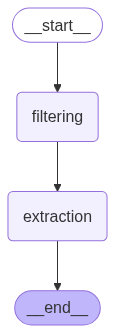

# Elucidata GenAI Biomedical Insight Extractor

## Project Overview
A prototype pipeline that filters and processes biomedical research articles using a GenAI-powered assistant. The system extracts structured insights such as diseases, genes, pathways, experimental methods, and key findings from unstructured `.md` files.
- Relevant Fiteration: The system filters out n only articles related to cancer or immunology
- Structured Insights: The system extracts structured insights such as diseases, genes, pathways, experimental methods, and key findings from filtered articles.


## Agentic Architecture


## Solution Overview

### Filteration pipeline
- Out of all the articles filters articles that are related to cancer or immunology, using both keyword matching and embeddings similarity.
- Used `all-MiniLM-L6-v2` fast, and effective sentence embedding model provided by `SentenceTransformers` for semantic similarity.

### Extraction pipeline
- Used `gemini-2.0-flash` model to sequentilly extract structured insights (like  diseases, genes, pathways, experimental methods, and key findings) from the filtered articles with `langchain` 
- Used a well structured prompt to extract insights from the articles, and parsed the extracted insights to a valid json file using `PydanticOutputParser`

### Agentic Architecture
- Used `langgraph` to create a state graph based workflow with two major nodes.
    - `filtering` node: Filters articles that are related to cancer or immunology using `filterationn pipeline` and stores the result in an output `filtered_articles.json` file.
    - `extraction` node: Extracts structured insights from the filtered articles using `extraction pipeline` and stores the result in an output `extracted_insights.json` file.

## Steps to run
1. Create a virtual environment: ```python -m venv venv```
2. Install dependencies: ```pip install -r requirements.txt```
3. set the environment variables: ```GOOGLE_API_KEY```
4. Run the script: ```python src/graph_builder.py```

## Results
- The output of the pipeline is stored in the `outputs` directory.
    - The `filtered_articles.json` file contains the filtered articles.
    - The `extracted_insights.json` file contains the extracted insights.

## Manual Evaluation of Extracted Insights (10/31 reviewed)
Manually reviewed 10 out of 31 LLM-processed biomedical research articles.

### Summary Table

| Article ID | Evaluation | Diseases | Genes/Proteins | Pathways | Experimental Methods | Key Findings |
|------------|----------------|-----------|-------------|----|----|-----------------|
| 39834406 | Fully Accurate | Neuroblastoma, Medullary thyroid cancer, Pheochromocytoma, Neuroendocrine tumors | Cell cycle-related genes | Cell cycle progression | scRNA-seq | Summarized functions of cell cycle-related genes in neuroendocrine tumors and their potential as therapeutic targets |
| 39908652   | Fully Accurate | Neuroblastoma | MDK, GPC2, B7-H3, MIF      | Immunosuppressive tumor microenvironments | scRNA-seq, bulk-RNA sequencing, mass-spectrometry, PROTAC technology       | MIF is a potent inhibitor of CAR T-cell activation and killing capacity in neuroblastoma. Targeting MIF with PROTAC enhanced CAR T-cell activity. A multi-omics pipeline was developed to identify immunosuppressive TME factors. |
| 40025479   | Fully Accurate | Esophageal squamous cell carcinoma | C1S, DCN, NBL1         | *(None specified)*       | single-cell RNA sequencing, scRNA-seq | Identified dynamic alterations in the ESCC microenvironment post-NCRT. Developed a myCAF prognostic signature responsive to immunotherapy. C1S, DCN, and NBL1 were found as potential ESCC risk-related genes. Ep_c1 subtype showed better prognosis and complex communication with myCAFs. |
| 40095971   | Fully Accurate | Leukemia | Cas9           | Inflammatory signaling pathways | CRISPR-Cas9, electroporation, Sanger sequencing, immunoblotting | Describes a high-efficiency protocol for CRISPR-Cas9-mediated knockout in THP-1 leukemia cells using electroporation. Achieved up to 100% indels and >95% protein depletion. Validated via ICE and immunoblotting. Enables single-cell clone isolation. |
| 40118716   | Fully Accurate | Neuroblastoma | UBE2C, PTTG1, AKT, mTOR | AKT/mTOR pathway | Single-cell RNA sequencing, bulk RNA-seq | Single-cell transcriptomics identified 17 neuroblastoma subpopulations. Adavosertib was found effective against a high-risk subpopulation by disrupting the AKT/mTOR pathway. UBE2C and PTTG1 were key drivers of drug resistance and poor prognosis. Study demonstrates a framework for single-cell guided drug repurposing. |
| 40121577   | Fully Accurate | Neuroblastoma | CHD5, TP63, XKR4, CTAG1A          | Apoptosis, pyroptosis, ferroptosis, autophagy, necroptosis, cuproptosis, disulfidptosis, Fatty acid metabolism | Consensus clustering analysis, random survival forest analysis, GSEA, single-cell dataset analysis, UMAP, Western blotting, immunohistochemical staining | Developed a fatty acid metabolism prognostic risk model identifying CHD5, TP63, XKR4, and CTAG1A as hub genes. CHD5 inhibits neuroblastoma proliferation, invasion, and metastasis. TP63 strongly correlates with cell death pathways. The model enhances chemotherapy and immunotherapy strategies for neuroblastoma. |
| 40157909   | Fully Accurate | Breast cancer | PRL, PRLR, YAP, CCN2, Ki67, Vimentin, CD44 | Hippo pathway, PRL/PRLR pathway, YAP-CCN2 pathway | CRISPR knockout, bioinformatics, in vitro       | Revealed an antagonistic relationship between the PRL/PRLR differentiation pathway and the YAP-CCN2 oncogenic pathway in breast cancer. Promoting PRL/PRLR signaling while inhibiting YAP-CCN2 can suppress cancer cell proliferation and stem-like properties, suggesting a viable differentiation-based therapeutic strategy. |
| 40163809   | Fully Accurate | Acute Myeloid Leukemia, Myeloproliferative Neoplasm, Post-MPN AML, Leukemia | BCL-xL, BCL2L1, TP53, JAK2  | Apoptosis | Single-cell multi-omics analysis, BH3 profiling, PROTAC, cell line-derived xenograft model             | Post-MPN AML is dependent on BCL-xL. DT2216, a BCL-xL degrader, induced apoptosis and reduced tumor burden in vitro and in vivo. Higher BCL2L1 expression was observed in post-MPN AML, especially with TP53 and JAK2 mutations. DT2216 shows promise as a single or combination therapy in this high-risk subset. |
| 40165206   | Fully Accurate | HER2-positive breast cancer | ERBB2, SLC46A3, TSC1, TSC2, mTOR | mTOR complex 1 | CRISPR/Cas9, whole-genome knockout screens, single-guide RNA (sgRNA) library, competition growth assays, growth inhibition assays | CRISPR screens revealed TSC1 and TSC2 as novel T-DM1 resistance genes. Knockout of TSC1/TSC2 increased resistance to T-DM1. T-DM1 combined with mTOR inhibitor everolimus showed synergistic effects. Findings may guide future strategies to improve T-DM1 efficacy. |
| 40179430   | Fully Accurate | Neuroblastoma | STEAP2         | Tumor microenvironment | Single-cell analysis, genomic sequencing, transcriptome dataset analysis, immune infiltration analysis, drug sensitivity analysis | Developed a CAFs-based prognostic model for neuroblastoma. High STEAP2 expression was linked to poor prognosis. Validated using multiple analyses and experimental confirmation in NB tissues. STEAP2 identified as a potential therapeutic target. |

### Accuracy
- **Fully Accurate**: 10/10


## Contact

- **Name**: Amber Goswami
- **Email**: ambergoswami9@gmil.com
